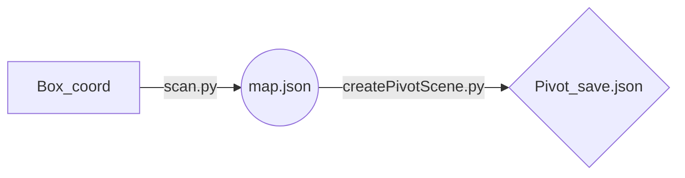

# Minecraft to Pivot

Mc2Pvt is a simple tool alowing you to create a pivot scene with any minecraft world.

Simply doawnload the repos and put the file in the region folder of your minecraft word.

The next step is to create a box that's cover the part of the word you want to pivot.

you should have 2 time 3 coords, simply call scaner.py with this coord box.

## The scanning prosses may take some times

The scaner will create a 1st json file where you have all the blocks of the selected region.

Pass this file to createPivotScene.py to get your Pivot save.

You can now load this scene like any other in the Pivot editor.

